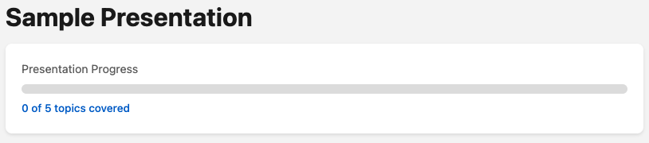
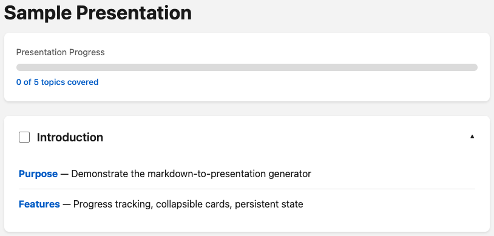
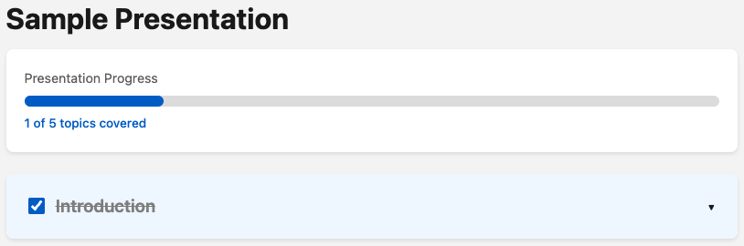
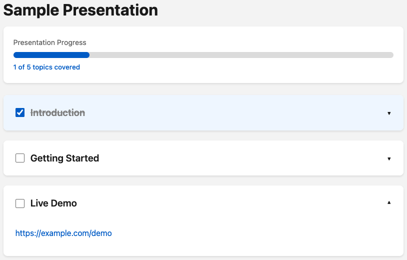

# markdown-to-presentation

Convert markdown files into interactive HTML presentations with progress tracking, collapsible sections, and localStorage persistence.


## Features

- **Progress Tracking** - Visual progress bar shows completion status across all sections
- **Countdown Timer** - Optional timer with visual feedback (amber at ≤1 min, red when expired)
- **Collapsible Cards** - Each section expands/collapses for focused viewing
- **Persistent State** - Checkboxes save to localStorage, survive page refreshes
- **Self-Contained Output** - Single HTML file, no external dependencies, works offline
- **Responsive Design** - Looks great on desktop and mobile
- **Theme Customization** - Easy color/font changes via CSS variables
- **Demo Section Support** - Embed URLs for live demos
- **Reset Functionality** - Clear all progress and timer with one click

## Preview


*Visual progress bar shows completion status across all sections*


*Click any section header to expand and view details*


*Check off sections to mark progress — completed sections auto-collapse*


*Embed live demo URLs directly in your presentation*

## Quick Start

```bash
# Convert a markdown file to presentation
python skills/generator.py your-presentation.md

# Or specify custom output path
python skills/generator.py your-presentation.md output.html

# With countdown timer (in minutes)
python skills/generator.py your-presentation.md --timer 15
```

Open the generated `presentation.html` in your browser.

## Installation

No installation required. The skill files are in the `skills/` directory:

- `skills/generator.py` - Python 3 script (no external dependencies)
- `skills/template.html` - HTML template with embedded CSS/JS

### Requirements

- Python 3.7+
- No pip packages needed (uses only standard library)

## Markdown Format

### Basic Structure

```markdown
# Your Presentation Title

## Section Name
- **Key term** — Description of the term
- **Another point** — More details here

## Demo Section
https://example.com/demo

## Questions & Answers
```

### Syntax Reference

| Element | Markdown Syntax |
|---------|-----------------|
| Title | `# Your Title` |
| Section | `## Section Name` |
| Checklist item | `- **Label** — Description` |
| Demo URL | `https://...` (on line after `## Demo` header) |

### Example Input

```markdown
# Project Kickoff

## Goals
- **Increase engagement** — Boost user engagement by 25%
- **Reduce latency** — Cut API response times in half
- **Improve UX** — Simplify the onboarding flow

## Architecture Overview
- **Frontend** — React with TypeScript
- **Backend** — Node.js microservices
- **Database** — PostgreSQL with Redis cache

## Live Demo
https://staging.example.com

## Q&A
```

## Output Features

### Progress Bar

Tracks how many sections you've completed. Updates in real-time as you check off sections.

### Countdown Timer

Optional timer embedded in the progress card. Displays remaining time in MM:SS format with subtle pale styling. Visual feedback: turns amber at ≤1 minute, red when expired. Resets when clicking "Reset Progress".

### Collapsible Cards

Click any section header to expand and view details. Checked sections auto-collapse.

### Persistent State

Your progress is saved automatically. Refresh the page or come back later - your state persists.

### Theme Customization

Edit CSS variables in the generated HTML to customize colors:

```css
:root {
  --primary-color: #0066cc;        /* Main accent color */
  --font-family: -apple-system, ...; /* Typography */
  --background: #f5f5f5;           /* Page background */
  --card-background: #ffffff;      /* Card backgrounds */
}
```

## How It Works

1. **Parse Markdown** - `generator.py` extracts title, sections, and checklist items
2. **Generate HTML** - Content is injected into `template.html`
3. **Write Output** - Self-contained HTML file ready to share

## Project Structure

```
markdown-to-presentation/
├── skills/
│   ├── generator.py       # Markdown parser and HTML generator
│   ├── template.html      # Reusable HTML/CSS/JS template
│   └── SKILL.md           # Claude skill documentation
├── examples/              # Sample presentations
├── LICENSE                # Apache 2.0 license
└── README.md              # This file
```

## Use Cases

- **Project Kickoffs** - Track agenda items and demos
- **Team Meetings** - Progress through topics systematically
- **Training Sessions** - Checklist-based learning modules
- **Product Demos** - Embed live URLs alongside feature descriptions
- **Workshop Facilitation** - Interactive group sessions with progress tracking
- **Study Guides** - Self-paced learning with completion tracking

## Browser Support

- Chrome/Edge (recommended)
- Firefox
- Safari
- Mobile browsers (iOS Safari, Chrome for Android)

Requires localStorage support and modern CSS (CSS custom properties, flexbox).

## Limitations

- Markdown format is intentionally simple - full CommonMark not supported
- Checklist items use `**bold** — text` format specifically
- Demo sections auto-detect URLs on the line immediately after the header
- Progress tracking uses section count (not individual checklist items)
- Timer feature requires `--timer` flag; not enabled by default

## Troubleshooting

**Presentation shows "Warning: No title found"**
- Add `# Your Title` as the first line of your markdown

**No sections appearing**
- Use `## Section Name` (exactly two hashes) for section headers

**Demo URL not showing**
- Put the URL on the line immediately after the `## Demo` header
- URL must start with `http://` or `https://`

## Development

### Running Tests

```bash
python skills/generator.py examples/sample.md
```

### Modifying the Template

Edit `skills/template.html` to change:
- CSS variables for theming
- Card layout and animations
- JavaScript behavior

### Extending the Parser

`skills/generator.py` uses regex-based parsing. Modify `parse_markdown()` to support new patterns.

## License

Apache License 2.0 - see [LICENSE](LICENSE) for details.

## Contributing

Contributions welcome! Areas for improvement:

- Support for more markdown patterns
- Additional output formats (PDF, reveal.js)
- Custom themes
- Accessibility enhancements
